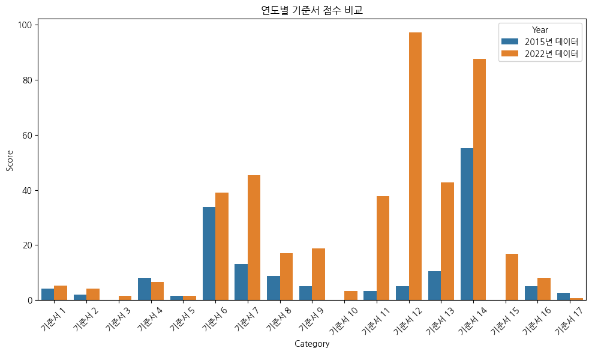
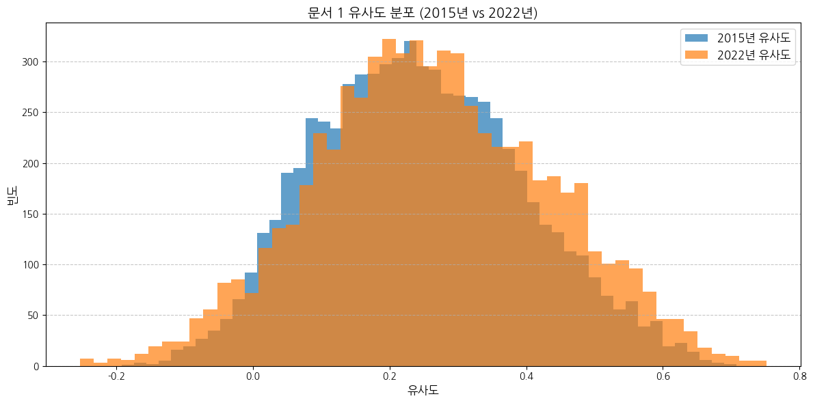
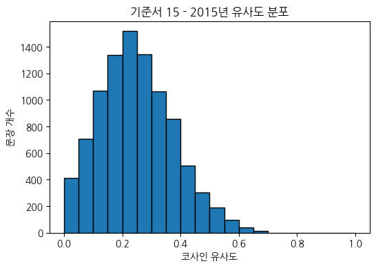
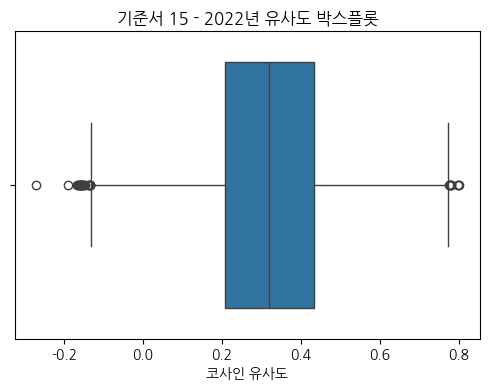
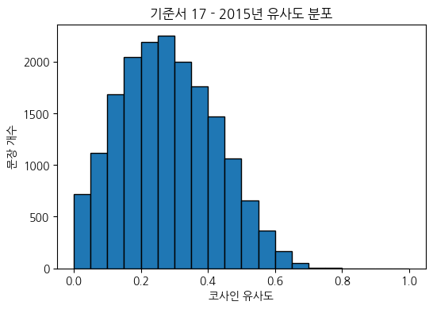
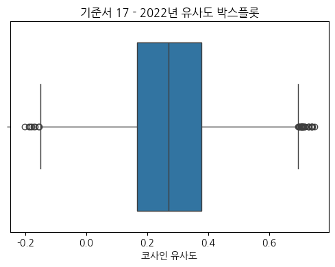

# Living Resources SDG Analysis

> **Data Analysis: Alignment of Korean Home Economics Textbooks' Living Resources Units with UN Sustainable Development Goals (2015 vs 2022)**

2015 개정 교육과정과 2022 개정 교육과정의 중학교 기술⋅가정 교과서 생활자원 단원이 UN의 17개 지속가능발전목표(SDGs)와 얼마나 연계되어 있는지를 정량적으로 분석한 데이터 분석 프로젝트입니다.

**본 프로젝트는 데이터 분석 부분만을 다룹니다.** 원본 데이터 및 논문의 상세 내용은 공개되지 않습니다.

---

## 📊 분석 개요

### 분석 목적

교육과정 개정(2015 → 2022)에 따른 교과서 내용의 **지속가능발전목표(SDGs) 반영도 변화**를 데이터 기반으로 정량화합니다.

### 분석 대상

- **2015 개정 교육과정** 중학교 기술⋅가정 교과서 생활자원 단원
- **2022 개정 교육과정** 중학교 기술⋅가정 교과서 생활자원 단원
- **UN SDGs 17개 목표** 공식 기준 문서

### 분석 방법

1. **TF-IDF 기반 키워드 가중치 점수 산출**
2. **SBERT 기반 문장 의미 유사도 분석**
3. **통계적 시각화** (박스플롯, 히스토그램, 바 차트)

---

## 📈 분석 결과

### 전체 요약

| 구분 | 2015년 교과서 | 2022년 교과서 | 변화 |
|------|----------:|----------:|:-----:|
| **평균 점수** | 9.356 | 25.499 | **+172.5%** |
| **최소 점수** | 0.000 | 0.780 | - |
| **최대 점수** | 55.222 | 97.281 | - |
| **중앙값** | 5.024 | 16.771 | **+233.9%** |

**결론**: 2022년 교과서는 2015년 대비 SDG 반영도가 **평균 2.7배 증가**



---

## 🎯 SDGs 목표별 점수

| SDG | 목표 | 2015년 | 2022년 | 변화량 | 변화율 |
|:---:|------|-------:|-------:|-------:|-------:|
| **1** | 빈곤퇴치 | 4.093 | 5.238 | +1.145 | +28.0% |
| **2** | 기아종식 | 2.041 | 4.244 | +2.203 | +107.9% |
| **3** | 건강과 웰빙 | 0.163 | 1.520 | +1.357 | +832.5% |
| **4** | 양질의 교육 보장 | 8.202 | 6.497 | -1.705 | -20.8% ⚠️ |
| **5** | 성평등 달성 | 1.648 | 1.531 | -0.117 | -7.1% ⚠️ |
| **6** | 깨끗한 물과 위생 보장 | 33.891 | 38.985 | +5.094 | +15.0% |
| **7** | 모두를 위한 에너지 보장 | 13.109 | 45.284 | +32.175 | +245.4% 🔥 |
| **8** | 경제성장과 양질의 일자리 | 8.777 | 17.078 | +8.301 | +94.6% |
| **9** | 사회기반 시설 산업화 및 혁신 | 5.043 | 18.867 | +13.824 | +274.1% 🔥 |
| **10** | 불평등 감소 | 0.149 | 3.314 | +3.165 | +2124.2% |
| **11** | 지속가능한 도시와 주거지 | 3.349 | 37.784 | +34.435 | +1028.4% 🔥 |
| **12** | 지속가능한 소비와 생산 | 5.154 | 97.281 | +92.127 | +1787.4% 🔥🔥 |
| **13** | 기후변화 대응 | 10.453 | 42.651 | +32.198 | +308.0% 🔥 |
| **14** | 해양생태계 보존 | 55.222 | 87.596 | +32.374 | +58.6% |
| **15** | 육상생태계 보호 | 0.000 | 16.771 | +16.771 | ∞ |
| **16** | 평화, 정의, 포용적인 제도 | 5.024 | 8.066 | +3.042 | +60.6% |
| **17** | 글로벌 파트너십 | 2.729 | 0.780 | -1.949 | -71.4% ⚠️ |

---

## 🔥 주요 발견

### 급격히 증가한 분야 (Top 5)

#### 1️⃣ SDG 12: 지속가능한 소비와 생산 (+1787.4%)

- **2015년**: 5.154점
- **2022년**: 97.281점
- **핵심 키워드**: 재활용, 재사용, 업사이클링, 제로웨이스트, 순환경제




---

#### 2️⃣ SDG 11: 지속가능한 도시와 주거지 (+1028.4%)

- **2015년**: 3.349점
- **2022년**: 37.784점
- **핵심 키워드**: 스마트시티, 친환경 주거, 도시농업




---

#### 3️⃣ SDG 13: 기후변화 대응 (+308.0%)

- **2015년**: 10.453점
- **2022년**: 42.651점
- **핵심 키워드**: 탄소중립, 온실가스, 기후위기




---

#### 4️⃣ SDG 9: 사회기반 시설 산업화 및 혁신 (+274.1%)

- **2015년**: 5.043점
- **2022년**: 18.867점
- **핵심 키워드**: 첨단 기술, 혁신, 인프라

---

#### 5️⃣ SDG 7: 에너지 보장 (+245.4%)

- **2015년**: 13.109점
- **2022년**: 45.284점
- **핵심 키워드**: 신재생에너지, 에너지 절약, 효율

---

### ⚠️ 감소한 분야

| SDG | 목표 | 변화율 |
|:---:|------|-------:|
| **17** | 글로벌 파트너십 | -71.4% |
| **4** | 양질의 교육 보장 | -20.8% |
| **5** | 성평등 달성 | -7.1% |

---

## 🔬 분석 방법론

### 1. TF-IDF 가중치 기반 점수 산출

```
기준서 점수 = Σ (SDG 핵심 키워드 등장 횟수 × TF-IDF 가중치)
```

- **도구**: Scikit-learn TfidfVectorizer
- **전처리**: KoNLPy Komoran 형태소 분석기
- **산출 방식**: 각 SDG별 상위 10개 키워드 추출 → 교과서 내 등장 빈도 계산

### 2. SBERT 의미 유사도 분석

```
코사인 유사도 = cos(SDG 문장 벡터, 교과서 문장 벡터)
```

- **모델**: `xlm-r-large-en-ko-nli-ststb` (다국어 Sentence-BERT)
- **벡터 차원**: 768차원
- **분석 단위**: 문장 단위 의미 유사도

### 3. 통계적 시각화

- **박스플롯**: 연도별 유사도 분포 비교
- **히스토그램**: 유사도 구간별 빈도 분석
- **바 차트**: 기준서별 점수 비교

---

## 🛠️ 기술 스택

### 언어 & 환경
- Python 3.x
- Jupyter Notebook (Google Colab)

### 자연어 처리
- **KoNLPy**: 한국어 형태소 분석
- **Scikit-learn**: TF-IDF, 코사인 유사도
- **Sentence-Transformers**: 문장 임베딩
- **Transformers (HuggingFace)**: 다국어 NLP 모델

### 데이터 분석 & 시각화
- **Pandas**: 데이터프레임 처리
- **NumPy**: 수치 연산
- **Matplotlib**: 그래프 생성
- **Seaborn**: 통계 시각화

---

## 📂 프로젝트 구조

```
Living-Resources-SDG-Analysis/
├── 가정교육_기준서_비교_연구 (1).ipynb   # 분석 노트북 (121개 그래프 포함)
├── 가정교육_기준서_비교_연구.py          # Python 스크립트
├── images/                               # 분석 결과 그래프 (121개)
│   ├── graph_01.png
│   ├── graph_02.png                      # 전체 점수 비교
│   ├── graph_03.png ~ graph_121.png      # SDG별 분석 그래프
└── README.md
```

**주의**: 원본 교과서 데이터 및 SDG 기준서 텍스트 파일은 저작권 문제로 공개되지 않습니다.

---

## 📊 시각화 예시

### 전체 비교 그래프


### SDG별 상세 분석 (예시)

#### SDG 12 (지속가능한 소비와 생산)


#### SDG 11 (지속가능한 도시)


#### SDG 13 (기후변화)


총 **121개의 분석 그래프**가 `images/` 폴더에 포함되어 있습니다.

---

## 💡 핵심 인사이트

### ✅ 확인된 사실

1. **2022년 교과서의 SDG 반영도가 2015년 대비 2.7배 증가**
2. **환경 분야(SDG 11, 12, 13, 14, 15)가 가장 크게 강화됨**
3. **17개 목표 중 14개에서 점수 상승, 3개에서 감소**
4. **지속가능한 소비/생산(SDG 12)이 가장 큰 폭으로 증가 (+1787%)**

### 🔍 주목할 점

- **신규 등장**: SDG 15 (육상생태계)가 2015년 0점에서 2022년 16.771점으로 신규 진입
- **상대적 약화**: SDG 17 (글로벌 파트너십) -71.4%, SDG 5 (성평등) -7.1%
- **환경 교육 중심화**: 기후변화, 순환경제, 에너지, 생태계 관련 내용 대폭 증가

---

## 📖 재현 방법

### 환경 설정 (Google Colab)

```bash
# 한글 폰트 설치
!apt-get update -qq
!apt-get install fonts-nanum -qq

# 필수 라이브러리 설치
!pip install konlpy wordcloud matplotlib seaborn
!pip install transformers sentencepiece sentence-transformers
!pip install scikit-learn pandas numpy
```

### 실행

1. `가정교육_기준서_비교_연구 (1).ipynb` 파일을 Google Colab에서 열기
2. 데이터 파일 준비 (원본 데이터는 저작권 문제로 제공되지 않음)
3. 런타임 → 모두 실행

---

## ⚠️ 데이터 공개 제한

- **원본 교과서 텍스트**: 저작권 문제로 공개 불가
- **SDG 기준서 텍스트**: 저작권 문제로 공개 불가
- **논문 상세 내용**: 저자 문제로 공개 불가

본 레포지터리는 **데이터 분석 결과 및 시각화만을 공개**합니다.

---

## 👤 Author

**이승욱 (Lee Seongwook)**

- **역할**: 데이터 분석 및 시각화
- **분석 도구**: Python, TF-IDF, SBERT
- **GitHub**: [wookidoki](https://github.com/wookidoki)

---

## 📄 License

MIT License

---

## 🔗 References
- [https://ebook-product.kyobobook.co.kr/dig/epd/scholardetail/product?cmdtcode=4050071786437]
기술⋅가정 교과서 생활자원 단원의 지속가능발전목표(SDGs) 연계성 분석 이지영
- [UN Sustainable Development Goals](https://sdgs.un.org/)
- [KoNLPy Documentation](https://konlpy.org/)
- [Sentence-Transformers Documentation](https://www.sbert.net/)

---

**Last Updated**: January 2024
